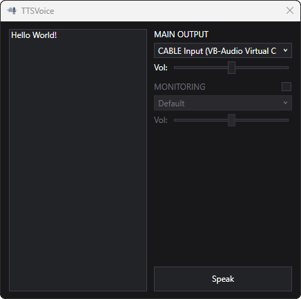

  

# TTSVoice

**TTSVoice** is a lightweight, desktop text-to-speech (TTS) routing tool designed for voice chats (like Discord). It allows users to synthesize speech from text and broadcast it through virtual audio devices while monitoring the output locally.

  

## 🚀 Key Features

- **Google TTS Integration:** Simple conversion of text to speech using Google's public API.
- **Dual Audio Output:** Ability to send audio to two different devices at the same time (e.g., a virtual cable and headphones).
- **Monitoring Toggle:** A simple switch to turn local playback on or off.
- **Independent Volume:** Separate sliders for each output with support for boosting volume up to 200%.
- **Custom UI:** A straightforward interface with a custom-made dark theme.

## 🏗️ Architecture & Design

The project is built using **Clean Architecture** and divided into three layers to keep the code organized and easy to modify:

- **`TTSVoice.Domain`**: Defines the core interfaces for the TTS and audio services. This layer is the foundation of the app and does not depend on any external libraries.
- **`TTSVoice.Infrastructure`**: Contains the implementation of the interfaces. It handles the web requests to the Google TTS API and manages audio output using the **NAudio** library.
- **`TTSVoice.UI`**: The WPF application. It follows the **MVVM** pattern using the **CommunityToolkit.Mvvm** library to handle data binding and UI state.

## 🛠️ Tech Stack

- **Framework:** .NET 9 (WPF)
- **MVVM Library:** [CommunityToolkit.Mvvm](https://github.com/CommunityToolkit/dotnet)
- **Speech Synthesis:** `HttpClient` for interacting with the Google Translate TTS API.
- **Audio Engine:** [NAudio](https://github.com/naudio/NAudio) for device management and playback.
- **Asynchrony:** Use of `CancellationToken` and `Task.WhenAll` for parallel streams and playback interruption.

## 📖 Setup & Usage

1. **Clone the repository:** 
   `git clone https://github.com/LialiukDanylo/TTSVoice.git`
2. **Install Virtual Cable:** Download and install [VB-Audio Virtual Cable](https://vb-audio.com/Cable/).
3. **Build & Run:** Open the `.sln` in Visual Studio 2022 and run the project.
4. **Configure Routing:**
   - Set **"CABLE Input"** as your **Main Output** in TTSVoice.
   - Set **"CABLE Output"** as your **Microphone** in your voice chat application.